## Introduction

Etant fan depuis ma jeune enfance des jeux d'aventure Monkey Island 1 et 2, ces jeux font partie de ces jeux que je n'oublierai jamais.
J'étais particulièrement content d'apprendre que Ron Gilbert s'apprêtait à sortir "Return to Monkey Island".


## 2022 Les premieres expérimentations

Et forcément après avoir travaillé plusieurs année sur `Thimbleweed Park`, j'étais bien sûr curieux de savoir comment ce jeu pouvait fonctionner.

J'ai vite découvert des outils permettant de lister le contenu des fichiers ressource Weird.ggpack*
Le fait de lister ces fichiers permet d'en apprendre beaucoup sur le moteur du jeu, surtout que certains fichiers n'étaient pas inconnus pour moi, les fichiers avec l'extension: .ggpack, .tsv, .txt, .json, .wimpy, .lip, .png, .yack étaient déjà utilisés dans `Thimbleweed Park`.

Il suffit de découvrir les fichiers inconnus: .atlas, .ktxbz, .attach, .anim, .blend, .emitter, .ttf, .otf, .bank, .dink, .dinky.

Je connais déjà les extensions .ttf et .otf qui sont des formats de fichier police les plus connus donc je ne vais pas entrer en détail pour eux.

Pour le fichier `Defines.dinky`, c'est plutôt facile à comprendre à quoi il sert puisqu'on peut lire le contenu directement dans un éditeur de texte, de plus si vous avez suivi le développement de [Delores](https://github.com/grumpygamer/DeloresDev), le format .dinky devrait déjà vous être familier.

Après un peu de recherche, j'ai découvert que les fichiers .atlas, .attach, .anim, .blend étaient des formats utilisés par la solution [Spine 2D](https://esotericsoftware.com/). Je ne le connaissais pas et maintenant je sais d'où viennent ces belles animations, cette solution est vraiment fantastique, jeter un oeil aux [démos](https://esotericsoftware.com/spine-demos).

Pour les fichiers .emitter vu son nom, je n'ai pas fait de recherche, je m'y intéresserais peut-être plus tard.

Les fichiers .bank sont des fichiers utilisés par la célèbre solution audio [fmod](https://www.fmod.com/).

Il ne reste plus que les fichiers .ktxbz.
En utilisant la commande `file`, nous avons vite un indice de son contenu:

```sh
file BarDrinking-hd.ktxbz
BarDrinking-hd.ktxbz: zlib compressed data
```

Puis en le renommant en .gz, en utilisant la commande gzip et la commande file de nouveau:

```sh
mv BarDrinking-hd.ktxbz BarDrinking-hd.gz
gzip -d BarDrinking-hd.gz
file BarDrinking-hd
```

On obtient: `BarDrinking-hd: Khronos KTX texture (little-endian), 396 x 227, RGB`

Vous pouvez en découvrir plus sur ce format [ici](https://texturecompression.com/blog/ktx-format-guide).

J'ai commencé à travailler dessus assez rapidement et j'ai réussi à lire le contenu des fichiers .ggpacks, lire les fichiers images compressées .ktxbz.

J'ai découvert ensuite les fichiers `spine`, et ça m'a permis de créer un programme permettant de jouer les animations des acteurs:


Ensuite je me suis intéressé aux fichiers .wimpy, ces fichiers existaient déjà pour TWP, je n'entrais donc pas dans un univers totalement inconnu, cepedant le fichier a fortement évolué depuis.
J'ai pu créer assez facilement un programme permettant d'afficher les "rooms" de ce jeu:


Cet outil est loin d'être parfait car les objets n'étaient pas positionnés forcément au bon endroit mais en tout cas le travail avançait bien... jusqu'à ce que je travaille sur la VM.

Pour la VM, rtmi utilise un langage maison appelé dinky (inspiré de squirrel, utilisé lui par TWP).
Et c'est là que tout a basculé, je suis rentré direct dans le sujet en essayant de coder directement toute la machine virtuelle et au bout d'un moment je n'avançais plus et ça m'a découragé.

## 2026 le retour

Depuis 2022, je n'avais pas retouché à ce code.
Et puis en décembre 2025, j'ai voulu retourner sur cette machine virtuelle en recommençant de zéro mais en y allant petit à petit.
J'ai commencé à écrire une mini machine virtuelle et je commençais à avoir des résultats, ça m'a motivé.
J'ai donc continué mon expérimentation jusqu'à obtenir ceci:


Là je suis tombé de nouveau sur un os, la machine virtuelle ne se comportait pas comme l'originale, je n'arrivais pas à trouver ce qui n'allait pas.
L'idéal serait de pouvoir créer son propre code et de pouvoir l'exécuter à la fois avec le vrai moteur et par le mien, afin de comprendre à quel moment j'ai des incohérence.
J'ai alors décidé de créer un compilateur de code dinky.

Voici un exemple de "Hello world" personnalisé en dinky:

```lua
function _main(args) {
  print("Hello ScummVM!")
}
```

Après une compilation `./dinky -c` et création du package ./Weird.ggpack1a `./dinky -p`, je peux exécuter le code avec le vrai jeu:



En passant plus de temps j'ai ajouté les différentes expressions +, -, *, / etc., les différentes boucles for, foreach, do, while et aussi le fait de pouvoir importer des fichiers.

Et après plusieurs essais/erreurs, je suis arrivé à ça:

### Roomhelper.dinky

```lua
_r_room_enter_stage = 0

function _defineRoom(name, room) {
  if (!is_string(name)) {
    error("Room name isn't a string")
  }
  if (!is_table(room)) {
    error("Room "+name+" isn't a valid table.")
  }
  room._sheet <- name
  if (name in roottable()) {
    error("Room "+name+" already defined.")
  }
  roottable()[name] <- room

  // See if there are any inventory objects.
  foreach (local key,value in room) {
    if (is_table(value)) {
      if ("icon" in value && "name" in value) {
        registerVerbs(value)
      }
    }
  }

  return room
}

function _receiveEnterActor(actor, stage) {
  print("Entered actor: ", actor, " at stage: ", stage)
}

function _receiveEnterObject(object) {
  print("Entered object: ", object._key)
  objectState(object, 0, 8192) // INSTANT
}

function _receiveEnterRoom(room, stage) {
  print("Entered room: ", room._sheet, " at stage: ", stage)
  if(room._key == "Void") {
    currentRoom = room
    return
  }
  _r_room_enter_stage = stage
  if (stage == 1) {
    currentRoom <- room
  }
  if (stage == 2) {
    if (is_function(room.enter,0)) {
      startthread(room.enter)
    } else
    if (is_function(room.enter,1)) {
      startthread(room.enter, null)
    }
  }
  // After Actors...
  if (stage == 3) {
    // TODO:
  }
}
```

### Boot.dinky

```lua
import("RoomHelpers.dinky")
import("LogoScreen.dinky")

SCREEN_CENTER <- point(SCREEN_CENTER_X, SCREEN_CENTER_Y)

defineRoom(LogoScreen)

function _main(args) {
    enterRoom(LogoScreen)
    local tid = startthread(@{
        objectAlpha(LogoScreen.logoTerribleToybox, 0)
        objectAlpha(LogoScreen.logoLucasfilm, 0)
        objectAlpha(LogoScreen.logoDevolver, 0)
        objectAlpha(LogoScreen.logoFMOD, 0)

        objectAlphaFromTo(LogoScreen.logoTerribleToybox, 7, 0.5, 0.0, 1.0)
        objectRotateFromTo(LogoScreen.logoTerribleToybox, 7, 1.0, 0, 180)
        breaktime(1.0)
    })
    breakwhilerunning(tid)
    print("Good bye!")

    quitgame()
}
```

## Divers

Voici différentes découvertes sur le jeu:

### Save.bin décrypté

Pour rendre le fichier save.bin plus compréhensible, entrez cette ligne dans votre fchier Prefs.json:

```lua
diddle: 6920
```

Et vous obtiendrez quelque chose comme ça dans le fichier save.bin:

```lua
booted: 1776167261
achievements: {
    AlmostHadAHeartAttack: -1
    Bookworm: 2
    Bragging: 11
    CardCollector: 8
    CartographyNerd: 5
    DeepSeaDiver: 1
    ExtraNeat: 5
    FanService: -1
    HeyWait: -1
    LuckyDuck: -1
    MopHeadCollector: 1
    Part1: -1
    Part2: -1
    Part3: -1
    Part4: -1
    Part5: -1
    SuperSwabbie: -1
    Trivia10: 1
    Trivia100: 1
    Trivia25: 1
    Trivia50: 1
    Trivia75: 1
    TrophyFisher: -1
}
collectable_room_info: {
    last_spawn_time: 0
    num_spawned: 0
}
overrides: [
    "opening"
]
```

Comment décompiler ce code:

```txt
Boot.dinky: receiveKeyDown (HLCEFFEFIPRXIMZO)const: 24, locals: 3, param_count: 1, param_def_count: 0, uses_upvars: false
const 00 string key
const 01 string _k_inventory
const 02 string _k_inventory_alt
const 03 string inventoryState
const 04 int 1
const 05 string openInventory
const 06 int 1
const 07 string _k_map
const 08 string _k_map2
const 09 string currentRoom
const 10 string _room_dark
const 11 string selectedActor
const 12 string sayLineToDark
const 13 string isSafeToOpenUI
const 14 string getLastMap
const 15 string map
const 16 string canOpen
const 17 string is_function
const 18 string open
const 19 string _k_todo
const 20 string TodoList
const 21 string is_open
const 22 string close
const 23 int 0
0000: 0233: 00010000 PUSH_LOCAL 1
0001:       00010000 PUSH_GLOBAL ::_k_inventory
0002:       003f0000 MATH 0x3f (TODO)
0003:       00008003 JUMP_TOPTRUE 4

0004:       00010000 POP
0005:       00010000 PUSH_LOCAL 1
0006:       00020000 PUSH_GLOBAL ::_k_inventory_alt
0007:       003f0000 MATH 0x3f (TODO)

0008:       00008002 JUMP_TOPFALSE 3

0009:       00010000 POP
0010:       00030000 PUSH_VAR inventoryState
0011:       00000000 FCALL 0

0012: 0239: 00008004 JUMP_FALSE 5

0013: 0235: 00040000 PUSH_CONST 1
0014:       00050000 PUSH_VAR openInventory
0015:       00010000 CALL 1
0016:       00060000 PUSH_CONST 1
0017: 0236: 00010000 RETURN

0018: 0239: 00010000 PUSH_LOCAL 1
0019:       00070000 PUSH_GLOBAL ::_k_map
0020:       003f0000 MATH 0x3f (TODO)
0021:       00008003 JUMP_TOPTRUE 4

0022:       00010000 POP
0023:       00010000 PUSH_LOCAL 1
0024:       00080000 PUSH_GLOBAL ::_k_map2
0025:       003f0000 MATH 0x3f (TODO)

0026: 0249: 0000801d JUMP_FALSE 30

0027: 0240: 00090000 PUSH_VAR currentRoom
0028:       000a0003 INDEX 10
0029: 0241: 00008002 JUMP_FALSE 3

0030: 0240: 000b0000 PUSH_VAR selectedActor
0031:       000c0006 INDEX 12
0032:       00000000 CALL 0

0033: 0241: 000d0000 PUSH_VAR isSafeToOpenUI
0034:       00000000 FCALL 0
0035: 0248: 00008014 JUMP_FALSE 21

0036: 0242: 000e0000 PUSH_VAR getLastMap
0037:       00000000 FCALL 0
0038:       00020000 STORE_LOCAL slot 2
0039: 0243: 00020000 PUSH_LOCAL 2
0040:       00008004 JUMP_TOPFALSE 5

0041:       00010000 POP
0042:       00020000 PUSH_LOCAL 2
0043:       00100003 INDEX 16
0044:       00110000 PUSH_VAR is_function
0045:       00010000 FCALL 1

0046:       00008003 JUMP_TOPFALSE 4

0047:       00010000 POP
0048:       00020000 PUSH_LOCAL 2
0049:       00100006 INDEX 16
0050:       00000000 FCALL 0

0051: 0247: 00008004 JUMP_FALSE 5

0052: 0244: 00020000 PUSH_LOCAL 2
0053:       00120006 INDEX 18
0054:       00000000 CALL 0
0055:       00060000 PUSH_CONST 1
0056: 0245: 00010000 RETURN

0057: 0249: 00010000 PUSH_LOCAL 1
0058:       00130000 PUSH_GLOBAL ::_k_todo
0059:       003f0000 MATH 0x3f (TODO)
0060: 0838: 00008019 JUMP_FALSE 26

0061: 0250: 00140000 PUSH_VAR TodoList
0062:       00150003 INDEX 21
0063: 0254: 00008004 JUMP_FALSE 5

0064: 0251: 00140000 PUSH_VAR TodoList
0065:       00160006 INDEX 22
0066:       00000000 CALL 0
0067:       00060000 PUSH_CONST 1
0068: 0252: 00010000 RETURN

0069: 0254: 00090000 PUSH_VAR currentRoom
0070:       000a0003 INDEX 10
0071: 0255: 00008002 JUMP_FALSE 3

0072: 0254: 000b0000 PUSH_VAR selectedActor
0073:       000c0006 INDEX 12
0074:       00000000 CALL 0

0075: 0255: 000d0000 PUSH_VAR isSafeToOpenUI
0076:       00000000 FCALL 0
0077:       00008002 JUMP_TOPFALSE 3

0078:       00010000 POP
0079:       00140000 PUSH_VAR TodoList
0080:       00120003 INDEX 18

0081: 0259: 00008004 JUMP_FALSE 5

0082: 0256: 00140000 PUSH_VAR TodoList
0083:       00120006 INDEX 18
0084:       00000000 CALL 0
0085:       00060000 PUSH_CONST 1
0086: 0257: 00010000 RETURN

0087:       00170000 PUSH_CONST 0
0088: 0839: 00010000 RETURN

0089:       00000000 RETURN
```



```mermaid
flowchart TD
  Block0["`**Block 0**
PUSH_LOCAL1
PUSH_GLOBAL::_k_inventory
MATH 0x3f
JUMP_TOPTRUE 4`"]

  Block4["`**Block 4**
POP
PUSH_LOCAL 1
PUSH_GLOBAL::_k_inventory_alt
MATH 0x3f (TODO)
`"]

  Block8["`**Block 8**
JUMP_TOPFALSE 3
`"]

  Block9["`**Block 9**
POP
PUSH_VAR inventoryState
FCALL 0
`"]

  Block12["`**Block 12**
JUMP_FALSE 5
`"]

  Block13["`**Block 13**
PUSH_CONST 1
PUSH_VAR openInventory
CALL 1
PUSH_CONST 1
RETURN
`"]

Block18["`**Block 18**
PUSH_LOCAL 1
PUSH_GLOBAL ::_k_map
MATH 0x3f (TODO)
JUMP_TOPTRUE 4
`"]

  Block22["`**Block 22**
POP
PUSH_LOCAL 1
PUSH_GLOBAL ::_k_map2
MATH 0x3f (TODO)
`"]

  Block26["`**Block 26**
JUMP_FALSE 30
`"]

Block27["`**Block 27**
PUSH_VAR currentRoom
INDEX 10
JUMP_FALSE 3
`"]

Block30["`**Block 30**
PUSH_VAR selectedActor
INDEX 12
CALL 0
`"]

Block33["`**Block 33**
PUSH_VAR isSafeToOpenUI
FCALL 0
JUMP_FALSE 21
`"]

Block36["`**Block 36**
PUSH_VAR getLastMap
FCALL 0
STORE_LOCAL slot 2
PUSH_LOCAL 2
JUMP_TOPFALSE 5
`"]

Block41["`**Block 41**
POP
PUSH_LOCAL 2
INDEX 16
PUSH_VAR is_function
FCALL 1
JUMP_TOPFALSE 4
`"]

Block46["`**Block 46**
POP
PUSH_LOCAL 2
INDEX 16
PUSH_VAR is_function
FCALL 1
JUMP_TOPFALSE 4
`"]

Block47["`**Block 47**
POP
PUSH_LOCAL 2
INDEX 16
FCALL 0
`"]

Block51["`**Block 51**
JUMP_FALSE 5
`"]

Block52["`**Block 52**
PUSH_LOCAL 2
INDEX 18
CALL 0
PUSH_CONST 1
RETURN
`"]

Block57["`**Block 57**
PUSH_LOCAL 1
PUSH_GLOBAL ::_k_todo
MATH 0x3f
JUMP_FALSE 26
`"]

Block61["`**Block 61**
PUSH_VAR TodoList
INDEX 21
JUMP_FALSE 5
`"]

Block64["`**Block 64**
PUSH_VAR TodoList
INDEX 22
CALL 0
PUSH_CONST 1
RETURN
`"]

Block69["`**Block 69**
PUSH_VAR currentRoom
INDEX 10
JUMP_FALSE 3
`"]

Block72["`**Block 72**
PUSH_VAR selectedActor
INDEX 12
CALL 0
`"]

Block75["`**Block 75**
PUSH_VAR isSafeToOpenUI
FCALL 0
JUMP_TOPFALSE 3
`"]

Block78["`**Block 78**
POP
PUSH_VAR TodoList
INDEX 18
`"]

Block81["`**Block 81**
JUMP_FALSE 5
`"]

Block82["`**Block 82**
PUSH_VAR TodoList
INDEX 18
CALL 0
PUSH_CONST 1
RETURN
`"]

Block87["`**Block 87**
PUSH_CONST 0
RETURN
`"]

Block89["`**Block 89**
RETURN
`"]

  Block0 --> Block4
  Block0 --> Block8
  Block4 --> Block8
  Block8 --> Block9
  Block8 --> Block12
  Block9 --> Block12
  Block12 --> Block13
  Block12 --> Block18
  Block18 --> Block22
  Block18 --> Block26
  Block22 --> Block26
  Block26 --> Block27
  Block26 --> Block57
  Block27 --> Block30
  Block27 --> Block33
  Block30 --> Block33
  Block33 --> Block36
  Block33 --> Block57
  Block36 --> Block46
  Block36 --> Block41
  Block41 --> Block46
  Block41 --> Block51
  Block46 --> Block47
  Block46 --> Block51
  Block47 --> Block51
  Block51 --> Block52
  Block51 --> Block57
  Block57 --> Block61
  Block57 --> Block87
  Block61 --> Block64
  Block61 --> Block69
  Block69 --> Block72
  Block69 --> Block75
  Block72 --> Block75
  Block75 --> Block78
  Block75 --> Block81
  Block78 --> Block81
  Block81 --> Block82
  Block81 --> Block87
```

```js
function receiveKeyDown(key) {
  if ((key == _k_inventory || key == _k_inventory_alt) && inventoryState()) {
      openInventory(1)
      return 1
  }

  if(key == _k_map || key == _k_map2) {
      if(currentRoom._room_dark) selectedActor.sayLineToDark()
      if(isSafeToOpenUI() && getLastMap() && is_function(getLastMap().canOpen) && getLastMap().canOpen()) {
          getLastMap().open()
          return 1
      }
  }

  if (key == _k_todo) {
    if(TodoList.is_open) {
      TodoList.close()
      return 1
    }

      if(currentRoom._room_dark) {
        selectedActor.sayLineToDark()
      }
      if (isSafeToOpenUI() || TodoList.open) {
          TodoList.open()
          return 1
      }
  }

  return 0
}
```
